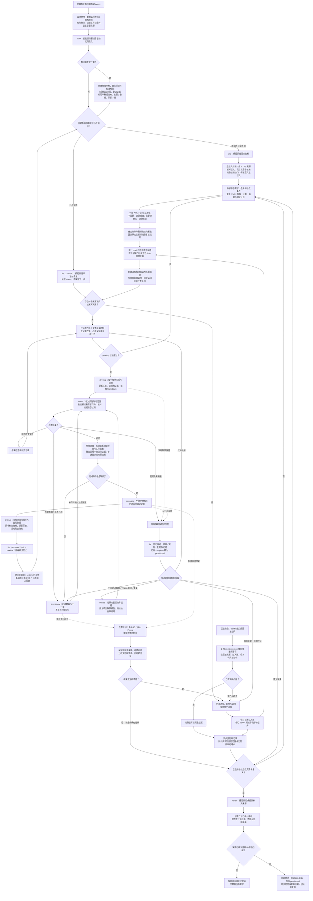

# 使用与迭代指南

## 工作原理

1. 在目标项目执行 scan，脚本盘点清单，Agent 阅读实际代码补全技术基线。
2. 导入 PRD，保留原始字节，Agent 生成 JSON 需求、任务、决策和追溯关系。
3. 开发前结构校验。按小模块实现、运行适用检查、更新证据。
4. 后补 API/Figma 时，推断差异可细化；一手证据冲突需记录并请用户决策。
5. 根据实际构建/测试结果和资料适用性决定 provisional 或 complete。

通用核心不要求 UI、后端或某一种语言。API/Figma 状态分别为 present / missing / unknown / not_applicable。只有业务范围不需要时才能 not_applicable，并在 feature.source_notes 中记录理由。present 表示资料存在，不自动表示已完成对齐。

## 日常工作流

适用版本：0.5.1；最后核对：2026-09-20。下图描述当前 Agent 工作流程；结构校验由脚本辅助，资料理解、冲突判断和最终完成条件仍需 Agent 结合证据核对。



读图时注意：

- **影响清单**：现有命令不变，Agent 在改代码前维护 impact.json。未决行为阻止开发；范围外改动、缺失或过期回归证据阻止 check。旧需求仅在继续改代码时采用；脚本不会自动发现全部关联。具体记录与兼容边界见 [影响核对](../skills/dev/core/references/impact-review.md)。

- **API、Figma 不是必经依赖**：功能不需要时记为 `not_applicable` 并说明理由；需要但尚未提供时允许有据可查的暂定实现，不允许宣称完整交付。
- **新证据随时可进入**：已有功能直接读取其记录并走“保留新版本 → 对齐 → 更新规格”分支，不重复初始化。来源版本与影响分析目前由 Agent 执行，尚未实现自动来源变更检测。仅修改既有模块的部分行为时，当前还需人工对照旧行为、要求改变与保留的行为，并核对调用方及相关回归；结构化影响面门禁仍在 [路线图](../ROADMAP.md) 中。
- **冲突先决策**：当前 develop 校验会在任一需求 blocked 时阻断整个功能的编码；可以继续无关分析和文档工作，但不能把任务级自动隔离当作已实现能力。
- **通过校验不等于 complete**：还需核对有效需求已确认、任务完成、无未决冲突、必要资料已对齐或合理不适用、追溯与测试证据齐全、适用质量检查实际通过。未满足时保持 provisional，并列出待办。
- **修复要留证据**：效果偏差登记到同一功能的 fixes.json，生成 fixes.md；初始原因可待查，任务描述遗漏与代码缺陷可共同记录。未验证且未有效关闭的问题阻止功能级 check；非缺陷、撤回和重复按修复规范记录 closed，不能替代原问题修复。代码 bug 不自动改变 PRD，需求变更和来源冲突须有来源与已确认决策。
- **恢复进度用 status**：Claude 输入 `/dev status FEAT-001`，Codex 输入 `$dev status FEAT-001`，先读取已有状态，再决定开发、补资料或检查；无需重走所有步骤。

### 选择当前需求

```text
/dev list
/dev use FEAT-001
/dev develop
/dev fix 返回后表单被清空
/dev clarify 返回应去哪里
/dev check
/dev status
```

新建仍用 `/dev prd /path/to/prd.md --feature FEAT-002`：完成分析、渲染和 draft 校验后自动选中；失败或 ID 已存在时保留旧选择，已有内容不覆盖。`use` 只选择已有需求，不创建需求。切换时摘要上一需求未完成事项，并显示新需求的名称、状态和下一步。

当前选择仅保存在当前会话、当前项目的上下文中，不写共享指针；新会话或选择丢失时重新选择。每次操作显示项目、ID、名称并校验记录。显式 ID 只对该次命令生效，不改变默认选择。底层脚本仍传明确 ID；多会话隔离依赖 Agent 遵守会话范围，并非主机插件提供的持久会话状态。`scan`/`list` 不需选需求，`status` 不会暗中切换，`use` 不切 Git 分支。详见[选择规则](../skills/dev/core/references/feature-selection.md)。

### 已确认需求的修订

```text
/dev revise FEAT-001 返回时需要保留表单，按已确认结论更新验收条件
/dev revise FEAT-001 根据补充说明调整返回行为 --source /path/to/补充说明.md
/dev status FEAT-001
```

原始 PRD 保持不变，当前 requirements.json 应用已确认修订后更新；修订另存 revisions/CHG-*.json，生成 revisions.md。新到资料不因时间较晚自动生效。Agent 区分代码 bug、原文误读、细节澄清和产品变更，复用已有决策依据，无需对已经确认的要求重复询问。

旧需求按需启用：先核对原规格已确认且完整复核，再登记基线 1；不批量迁移，不把旧 complete 自动认定为版本化验收。登记基线后，已有 complete 会转 provisional，待当前代码重新完成版本绑定验证。原历史报告保留。每次修订只修改指明字段；旧版本或修改前值冲突时停止覆盖。同一需求先只允许一项待确认/待落实修订。

确认版本推进不代表代码完成。应用后同步任务、相关实现及 PRD 读取映射，重新复核；项目检查使用 `project.py check <PROJECT> --feature <ID>`，实际验收后用 revise.py verify 登记版本、代码提交与报告哈希。该登记不自动设置 complete。状态可显示“确认 v2、已验收 v1”；旧测试报告不能直接证明新版本。原文/新证据的语义与实际验收仍由 Agent 和用户核对。详见[修订规范](../skills/dev/core/references/revision-workflow.md)。

### 需求归档与按模块查找

```text
/dev classify FEAT-001 --module wallet --module identity
/dev archive FEAT-001
/dev list
/dev list --archived
/dev list --all --module wallet
/dev restore FEAT-001
```

归档仅适用于已完成并有真实交付依据的需求。Agent 核对验收报告及代码版本后登记；原目录、原文、修复、决策和证据保留。默认 list 显示未归档需求，历史按需读取；不会为了归档扫描全项目。分类为多选标签，重复 classify 会替换该需求的标签集合，`--clear-modules` 可清空；未分类需求仍在普通列表中。

归档状态与 complete 独立，恢复不改历史验收；继续开发、修复或澄清前恢复。只读历史查看无需恢复，当前会话选择也不会被归档自动替换。模块标签只是查找入口，相关实现细节仍须核对当前代码与测试。暂不提供压缩删除、模块当前行为索引、规则自动取代或增量扫描保证。详见[归档规范](../skills/dev/core/references/feature-archive.md)。

### 需求疑问、补充与影响分析

`/dev clarify FEAT-001 疑问或提议` 将事项记入现有 decisions.json 并返回 D 编号。Agent 先查原文、历史决策和代码，区分解释、遗漏、冲突与新增变更；影响旧功能时核对需要改变及保留的行为。产品取舍未明确则保持待决；已有明确确认不重复询问。普通讨论中的实质问题在 Skill 已加载时同样留痕，纯解释或明确要求仅讨论的内容不自动登记。

待决事项沿用整个功能的 develop/check 门禁。已确认但未落实的事项可进入开发、不能通过最终 check；落实不等于真机验收通过。已有 complete 登记新澄清后转 provisional，不自动恢复。发生实际效果偏差时转 fix 并关联同一决策。字段契约见 [澄清流程](../skills/dev/core/references/clarify-workflow.md)。这不保证自动识别所有普通对话，也不实现完整 PRD 版本传播。

### 当前规则的已知缺口

0.4.6 已检查修复测试的需求/任务关联，跨范围测试须逐项说明原因，并提供非缺陷关闭路径；说明本身不证明覆盖真实。历史 verified 也不代表当前改动已回归；PRD 复核摘要不覆盖子任务描述变更。使用时仍需核对实际证据，不能用 FEATURE_VALID 代替业务验收。上述缺口与后续安排见 [路线图](../ROADMAP.md)，当前流程图不把待实现规则画成已有流程。

### 流程图维护约定

本节是日常流程的统一可读入口，与 `skills/dev/SKILL.md`、脚本实现及 `MAINTAINER.md` 中的实际限制保持一致。修改命令、状态、资料适用性、冲突处理或质量门禁时，在同一次改动中同步检查并更新本图、说明和核对日期；未实现能力只写入 ROADMAP，不画成现有自动流程。这里的“同步更新”是维护约定，并非自动生成机制。

## 不同格式 PRD 的一致性处理

`/dev prd` 保留单文件调用，也可重复指定 `--source` 添加文档或 HTML；Agent 按统一分析规范读取不同风格的 PRD，不要求产品重写模板。

- `spec/prd-intake.json`：读取单元、原文摘录、上下文、关联条目、条件/例外覆盖及复核记录。
- `spec/prd-analysis.md`：生成的可读分析视图，方便查看缺口和映射。
- `requirements.json`：仍是唯一业务规格，每条有效需求以 `source_item_ids` 关联原文条目。

资料读取状态与业务未知信息分开：图片打不开是读取缺口；原文没有定义超时是未说明；功能没有 UI 才可能不需要设计稿。规则、示例、建议、背景和待定内容也分别记录，避免把举例当成强约束。

开发前会检查清单完成、读取缺口已处理、来源条目有去向、需求有反向关联、条件/例外映射已复核。复核后来源字节、条目或需求语义改变，会使复核失效；任务进度变化不要求重复阅读 PRD。复核摘要仅用于本地新鲜度检查，不等于第二步的完整来源版本管理。

复核登记由 Agent 完成，不需要用户每次批准。待决来源条目或无法读取的单元可用 `review-prd.py --stage draft` 登记已读部分和缺口；这份局部复核不能用于 develop/check。缺口解决后重新回读原文并登记完整复核。重大歧义仍按冲突流程询问；当前读取缺口和冲突门禁是整个功能级别，尚未实现局部任务隔离。脚本无法证明原文是否全部被枚举、摘录是否准确或语义是否理解正确，因此仍需回读原文核对。

升级已有 0.3 工作区时，保留原文件并补充 `prd-intake.json` 和 `source_item_ids`，实际复核后登记。可以查看状态和渲染原记录；draft 会提醒缺失，develop/check 会阻止未经复核的继续开发。不要重新执行初始化覆盖旧工作区。字段格式和操作顺序见 [PRD 分析规范](../skills/dev/core/references/prd-analysis.md)。

## 项目质量配置

scan 先在草稿中生成或保留 `quality-gates.json`，发布后位于 `.agent-workflow/project-baseline/quality-gates.json`；首次生成时 gates 为空。Agent 根据项目 CI/构建文件填入命令，不凭语言猜测命令。示例：

```json
{"gates":[{"name":"unit","command":["python3","-m","unittest","discover"],"cwd":".","timeout_seconds":600}]}
```

候选检查保存在 `quality-candidates.json`，其中的条件与模板供 Agent 选择参考，不会被执行器运行。每次 check 前按本次改动、项目规则和已有授权选择具体命令，填入 `quality-gates.json`；不要重复选择整套 preflight 与其子检查。

每个列出的 gate 都必须通过。命令参数数组避免 shell 拼接；这些命令仍会执行项目代码，需在执行前核对。脚本生成 quality-report.json，Agent 将本次结果及限制写入功能 delivery-report.md。未配置、缺运行环境或测试失败不算通过。

scan 结束使用 `project.py validate-gates <PROJECT>` 只校验配置。字符串命令、未填模板参数和不支持的 `when` 等字段会报错；空清单会明确提示待选择，不能作为质量通过。此校验不验证 Gradle 任务实际可运行。已验证修复的回归测试应由相关实际执行命令在 `test_ids` 中登记；只声明测试 ID 而命令未选择它，仍属人工记录错误。

基线新增 `coverage.md`（模块分析范围/证据/待补项）、`evidence-files.json`（实际引用的规范、配置和示例路径）。根目录 AGENTS.md/CLAUDE.md 与登记的证据进入 v2 指纹，未提交的这些文件变化也会使其过期。它仍不是完整增量扫描，未登记源码变化及跨模块影响需另外核对。

## 兼容和迁移

- JSON 项目继续使用原路径；0.4 新增读取与覆盖复核门禁，旧工作区在继续开发前需要补全上述证据，不自动宣称已迁移。
- 旧 missing/unknown 必须逐项判断适用性，不能机械替换为 not_applicable。
- 0.4.1 要求每个实际检查有唯一 name；旧配置中的字符串命令和条件字段需迁移，条件/模板移到候选文件，再选择具体命令。
- 新 scan 使用 v2 清单与登记证据指纹；旧指纹验证会过期，重新扫描并审查基线说明。
- migrate-workspace.py 仅创建 migration_required 脚手架；保留旧 YAML，不自动理解转换。遇到任何已有 JSON 目标都拒绝写入。迁移时由 Agent 逐条重建并核对来源与决策，再清除 migration_required、验证及渲染。
- render-workspace.py 会覆盖生成 Markdown。旧手写 Markdown 先保存在迁移备份中，不能丢弃其中未结构化的决策。

## 安装分发

当前选择“克隆 + 一个 Python 安装命令”：不依赖远程安装服务，也不需要维护两份 Skill。安装器把同一个 skills/dev 完整复制到个人发现目录。更新需 git pull 后再次运行 --update；不是自动同步。

仓库地址：[P3rryW4ng/feature-delivery-skill](https://github.com/P3rryW4ng/feature-delivery-skill)。代码提交到远端后，给使用者发送仓库 README 即可。Codex 用户也可请求内置 skill-installer 安装仓库中的 skills/dev（访问私库须授权）；本仓库测试覆盖的是本地安装脚本。

## 维护交接

对其他 Agent 说：

> 继续维护 feature-delivery-skill。先读 MAINTAINER.md、ROADMAP.md、CHANGELOG.md、docs/decisions/architecture.md 和 skills/dev/SKILL.md。运行已有测试，核对实现与文档；只实施当前明确授权的下一项，不改变既定原则。完成后更新变更记录、版本和交接状态，报告实际验证及限制。

Git 管理本体；项目 .agent-workflow/ 另行管理。聊天分享链接只是背景，不能替代可运行代码和交接文档。

## 扫描文件保留（0.4.2）

`/dev scan` 由 Agent 执行“创建草稿 → 阅读与更新 → 校验并发布”。正式基线固定一份，内容变化时保存旧版本，默认保留最近 3 份程序管理的历史快照；无变化不创建备份。扫描失败保留旧基线，草稿可继续修改。扫描期间已登记的项目内容或正式基线变化，会拒绝发布过期草稿。

备份中的 `PINNED` 空文件可保护重要快照，受保护版本不计入 3 份上限。旧手工备份、安装备份，以及 PRD、任务、决策和开发记录均不在清理范围。该策略从新版生成的托管备份开始生效，旧备份不会自动减少。

程序接口与恢复步骤见 Skill 内 `core/references/project-baseline.md`。校验通过只证明结构和配置符合要求；分析内容仍需回读证据，不等于已实现完整增量扫描或语义准确性保证。


## Git 提交与换机接续（0.4.3）

在业务项目中，Agent 首次使用或采用此规则时运行 Skill 内的 `core/scripts/setup-workflow-git.py <PROJECT>`。它只配置 `.agent-workflow/.gitignore`，不自动提交或上传；已有规则保留，已跟踪的本地文件或上层整目录忽略会提示核对。

- 提交经过审阅的当前基线、共享配置/候选检查，以及需求、任务、决策、追溯与交付结论。
- 忽略指纹、当次检查选择/原始运行报告、草稿、锁和备份。忽略规则不能取消已有跟踪，也不能清除历史。
- 原始 PRD/API/设计来源默认忽略，按仓库权限逐项决定共享。规格、intake 引文也可能包含保密内容，需要一起审阅。未随 Git 共享的必要来源须通过授权渠道恢复，不能凭分析摘要冒充原文复核。
- 换电脑克隆后，先读取已有记录。缺少本机指纹时创建扫描草稿、复核当前证据并发布；有效说明保留，检查命令按新环境选择。脚本不保证免除读取或完整增量扫描。

完整目录规则、精确放行例子和恢复流程见 [Git 协作规则](../skills/dev/core/references/git-sharing.md)。Skill 仓库本身继续忽略整个业务 `.agent-workflow/`，不要将业务项目模板替换到 Skill 仓库根目录。


## 文档与 HTML 组合输入（0.4.4）

可只给文档、只给 HTML，或在第一份资料后重复使用 `--source` 加入其他文件。示例：`/dev prd requirements.md --feature FEAT-001 --source prototype.html`。对应初始化脚本为 `init-feature.sh FEAT-001 requirements.md <PROJECT> --source prototype.html`。两部分共同构成同一需求的证据；缺少一种类型本身不算缺口。

Agent 逐份登记阅读单元。对于 HTML，实际可观察的交互记录触发动作、操作前后状态、定位点和观察方式；无法运行的依赖、不可访问的状态或未读内容记录为缺口。示例数据不直接写成已确认业务规则。文档与交互矛盾时，关联两个来源并留下待决事项。开发前校验会检查每个登记来源都有阅读单元、HTML 有交互单元或静态范围说明、已观察交互具备字段及复核是否过期；不会自动判断交互是否被完整穷举或事实是否正确。


## 效果偏差与修复（0.4.6）

输入 `/dev fix FEAT-001 <问题描述>`（Codex 为 `$dev fix`）。Agent 先用 `record-fix.py` 在已有功能下生成 FIX 编号和 fixes.json，立即生成 fixes.md；用户只给问题描述时，预期、实际与根因可以先留空，不伪造事实。原本标为 complete 的功能会回到 provisional。之后查原始来源、运行表现和现有实现，关联需求、任务、决策、代码及测试。

核对原始资料、已确认决策、生成的子任务与代码后，再分类为代码缺陷、任务描述缺口、原文误读、真实需求变更、来源冲突或环境问题；可记录主因和附加成因。代码缺陷只修实现和回归测试；误读需重审原文与需求映射；需求变更和来源冲突要保留新来源，并关联已确认决策与确认依据。更新 JSON 后运行 render-workspace.py 生成 fixes.md。修复记录标记 verified 前要填预期/实际、原因、处理方式、观测证据、验证结果与被测代码版本，并关联受影响需求/任务的回归测试，跨范围逐项说明覆盖原因，或写明豁免理由；脚本只检查结构和关联，不判断根因或测试真假。

进行修复时 develop 校验只提示未关闭问题；功能级 check 会拒绝既未验证、也未有效关闭的修复记录；重复报告关闭后，未解决的原问题仍阻断检查。项目检查仍可单独运行以收集证据；为运行了已登记回归的检查项填写 `test_ids`，检查命令要实际选中对应测试。完成验证后运行 `audit-delivery.py <PROJECT> <FEATURE-ID>` 比对已通过的检查、修复回归 ID 与项目快照，再人工核对任务/决策、测试断言、未登记代码变化和最新交付报告，最后运行功能级 check。既有工作区没有 fixes.json 时保持兼容。0.5.0 已提供可选语义基线与修订登记；完整来源版本管理与自动影响分析仍在后续阶段，详见 [修复流程](../skills/dev/core/references/fix-workflow.md)。

例如用户已明确“B 页点击返回应回到 A 页”，但实际出现 A → B → 返回 → B 的循环：先登记现象，核对这次确认是否已进入决策、需求验收和子任务。若子任务漏写返回语义，同时代码导航也错误，可在同一 FIX 中记录 `task_description_gap` 与 `implementation_defect`，保留任务描述前后文本，修正实现并增加 A → B → 返回 → A 的回归检查。不能仅凭循环现象断言是哪一层出错；只有发现产品原本要改变行为，才走需求变更流程。
