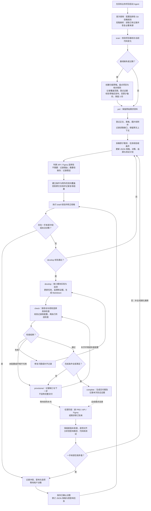

# 使用与迭代指南

## 工作原理

1. 在目标项目执行 scan，脚本盘点清单，Agent 阅读实际代码补全技术基线。
2. 导入 PRD，保留原始字节，Agent 生成 JSON 需求、任务、决策和追溯关系。
3. 开发前结构校验。按小模块实现、运行适用检查、更新证据。
4. 后补 API/Figma 时，推断差异可细化；一手证据冲突需记录并请用户决策。
5. 根据实际构建/测试结果和资料适用性决定 provisional 或 complete。

通用核心不要求 UI、后端或某一种语言。API/Figma 状态分别为 present / missing / unknown / not_applicable。只有业务范围不需要时才能 not_applicable，并在 feature.source_notes 中记录理由。present 表示资料存在，不自动表示已完成对齐。

## 日常工作流

适用版本：0.4.3；最后核对：2026-09-17。下图描述当前 Agent 工作流程；结构校验由脚本辅助，资料理解、冲突判断和最终完成条件仍需 Agent 结合证据核对。



读图时注意：

- **API、Figma 不是必经依赖**：功能不需要时记为 `not_applicable` 并说明理由；需要但尚未提供时允许有据可查的暂定实现，不允许宣称完整交付。
- **新证据随时可进入**：已有功能直接读取其记录并走“保留新版本 → 对齐 → 更新规格”分支，不重复初始化。来源版本与影响分析目前由 Agent 执行，尚未实现自动来源变更检测。
- **冲突先决策**：当前 develop 校验会在任一需求 blocked 时阻断整个功能的编码；可以继续无关分析和文档工作，但不能把任务级自动隔离当作已实现能力。
- **通过校验不等于 complete**：还需核对有效需求已确认、任务完成、无未决冲突、必要资料已对齐或合理不适用、追溯与测试证据齐全、适用质量检查实际通过。未满足时保持 provisional，并列出待办。
- **恢复进度用 status**：Claude 输入 `/dev status FEAT-001`，Codex 输入 `$dev status FEAT-001`，先读取已有状态，再决定开发、补资料或检查；无需重走所有步骤。

### 流程图维护约定

本节是日常流程的统一可读入口，与 `skills/dev/SKILL.md`、脚本实现及 `MAINTAINER.md` 中的实际限制保持一致。修改命令、状态、资料适用性、冲突处理或质量门禁时，在同一次改动中同步检查并更新本图、说明和核对日期；未实现能力只写入 ROADMAP，不画成现有自动流程。这里的“同步更新”是维护约定，并非自动生成机制。

## 不同格式 PRD 的一致性处理

`/dev prd` 的调用方式不变；Agent 按统一分析规范读取不同风格的 PRD，不要求产品重写模板。

- `spec/prd-intake.json`：读取单元、原文摘录、上下文、关联条目、条件/例外覆盖及复核记录。
- `spec/prd-analysis.md`：生成的可读分析视图，方便查看缺口和映射。
- `requirements.json`：仍是唯一业务规格，每条有效需求以 `source_item_ids` 关联原文条目。

资料读取状态与业务未知信息分开：图片打不开是读取缺口；原文没有定义超时是未说明；功能没有 UI 才可能不需要设计稿。规则、示例、建议、背景和待定内容也分别记录，避免把举例当成强约束。

开发前会检查清单完成、读取缺口已处理、来源条目有去向、需求有反向关联、条件/例外映射已复核。复核后来源字节、条目或需求语义改变，会使复核失效；任务进度变化不要求重复阅读 PRD。复核摘要仅用于本地新鲜度检查，不等于第二步的完整来源版本管理。

复核登记由 Agent 完成，不需要用户每次批准。重大歧义仍按冲突流程询问；当前读取缺口和冲突门禁是整个功能级别，尚未实现局部任务隔离。脚本无法证明原文是否全部被枚举、摘录是否准确或语义是否理解正确，因此仍需回读原文核对。

升级已有 0.3 工作区时，保留原文件并补充 `prd-intake.json` 和 `source_item_ids`，实际复核后登记。可以查看状态和渲染原记录；draft 会提醒缺失，develop/check 会阻止未经复核的继续开发。不要重新执行初始化覆盖旧工作区。字段格式和操作顺序见 [PRD 分析规范](../skills/dev/core/references/prd-analysis.md)。

## 项目质量配置

scan 先在草稿中生成或保留 `quality-gates.json`，发布后位于 `.agent-workflow/project-baseline/quality-gates.json`；首次生成时 gates 为空。Agent 根据项目 CI/构建文件填入命令，不凭语言猜测命令。示例：

```json
{"gates":[{"name":"unit","command":["python3","-m","unittest","discover"],"cwd":".","timeout_seconds":600}]}
```

候选检查保存在 `quality-candidates.json`，其中的条件与模板供 Agent 选择参考，不会被执行器运行。每次 check 前按本次改动、项目规则和已有授权选择具体命令，填入 `quality-gates.json`；不要重复选择整套 preflight 与其子检查。

每个列出的 gate 都必须通过。命令参数数组避免 shell 拼接；这些命令仍会执行项目代码，需在执行前核对。脚本生成 quality-report.json，Agent 将本次结果及限制写入功能 delivery-report.md。未配置、缺运行环境或测试失败不算通过。

scan 结束使用 `project.py validate-gates <PROJECT>` 只校验配置。字符串命令、未填模板参数和不支持的 `when` 等字段会报错；空清单会明确提示待选择，不能作为质量通过。此校验不验证 Gradle 任务实际可运行。

基线新增 `coverage.md`（模块分析范围/证据/待补项）、`evidence-files.json`（实际引用的规范、配置和示例路径）。根目录 AGENTS.md/CLAUDE.md 与登记的证据进入 v2 指纹，未提交的这些文件变化也会使其过期。它仍不是完整增量扫描，未登记源码变化及跨模块影响需另外核对。

## 兼容和迁移

- JSON 项目继续使用原路径；0.4 新增读取与覆盖复核门禁，旧工作区在继续开发前需要补全上述证据，不自动宣称已迁移。
- 旧 missing/unknown 必须逐项判断适用性，不能机械替换为 not_applicable。
- 0.4.1 要求每个实际检查有唯一 name；旧配置中的字符串命令和条件字段需迁移，条件/模板移到候选文件，再选择具体命令。
- 新 scan 使用 v2 清单与登记证据指纹；旧指纹验证会过期，重新扫描并审查基线说明。
- migrate-workspace.py 仅创建 migration_required 脚手架；保留旧 YAML，不自动理解转换。遇到任何已有 JSON 目标都拒绝写入。迁移时由 Agent 逐条重建并核对来源与决策，再清除 migration_required、验证及渲染。
- render-workspace.py 会覆盖生成 Markdown。旧手写 Markdown 先保存在迁移备份中，不能丢弃其中未结构化的决策。

## 安装分发

当前选择“克隆 + 一个 Python 安装命令”：不依赖远程安装服务，也不需要维护两份 Skill。安装器把同一个 skills/dev 完整复制到个人发现目录。更新需 git pull 后再次运行 --update；不是自动同步。

仓库地址：[P3rryW4ng/feature-delivery-skill](https://github.com/P3rryW4ng/feature-delivery-skill)。代码提交到远端后，给使用者发送仓库 README 即可。Codex 用户也可请求内置 skill-installer 安装仓库中的 skills/dev（访问私库须授权）；本仓库测试覆盖的是本地安装脚本。

## 维护交接

对其他 Agent 说：

> 继续维护 feature-delivery-skill。先读 MAINTAINER.md、ROADMAP.md、CHANGELOG.md、docs/decisions/architecture.md 和 skills/dev/SKILL.md。运行已有测试，核对实现与文档；只实施当前明确授权的下一项，不改变既定原则。完成后更新变更记录、版本和交接状态，报告实际验证及限制。

Git 管理本体；项目 .agent-workflow/ 另行管理。聊天分享链接只是背景，不能替代可运行代码和交接文档。

## 扫描文件保留（0.4.2）

`/dev scan` 由 Agent 执行“创建草稿 → 阅读与更新 → 校验并发布”。正式基线固定一份，内容变化时保存旧版本，默认保留最近 3 份程序管理的历史快照；无变化不创建备份。扫描失败保留旧基线，草稿可继续修改。扫描期间已登记的项目内容或正式基线变化，会拒绝发布过期草稿。

备份中的 `PINNED` 空文件可保护重要快照，受保护版本不计入 3 份上限。旧手工备份、安装备份，以及 PRD、任务、决策和开发记录均不在清理范围。该策略从新版生成的托管备份开始生效，旧备份不会自动减少。

程序接口与恢复步骤见 Skill 内 `core/references/project-baseline.md`。校验通过只证明结构和配置符合要求；分析内容仍需回读证据，不等于已实现完整增量扫描或语义准确性保证。


## Git 提交与换机接续（0.4.3）

在业务项目中，Agent 首次使用或采用此规则时运行 Skill 内的 `core/scripts/setup-workflow-git.py <PROJECT>`。它只配置 `.agent-workflow/.gitignore`，不自动提交或上传；已有规则保留，已跟踪的本地文件或上层整目录忽略会提示核对。

- 提交经过审阅的当前基线、共享配置/候选检查，以及需求、任务、决策、追溯与交付结论。
- 忽略指纹、当次检查选择/原始运行报告、草稿、锁和备份。忽略规则不能取消已有跟踪，也不能清除历史。
- 原始 PRD/API/设计来源默认忽略，按仓库权限逐项决定共享。规格、intake 引文也可能包含保密内容，需要一起审阅。未随 Git 共享的必要来源须通过授权渠道恢复，不能凭分析摘要冒充原文复核。
- 换电脑克隆后，先读取已有记录。缺少本机指纹时创建扫描草稿、复核当前证据并发布；有效说明保留，检查命令按新环境选择。脚本不保证免除读取或完整增量扫描。

完整目录规则、精确放行例子和恢复流程见 [Git 协作规则](../skills/dev/core/references/git-sharing.md)。Skill 仓库本身继续忽略整个业务 `.agent-workflow/`，不要将业务项目模板替换到 Skill 仓库根目录。
