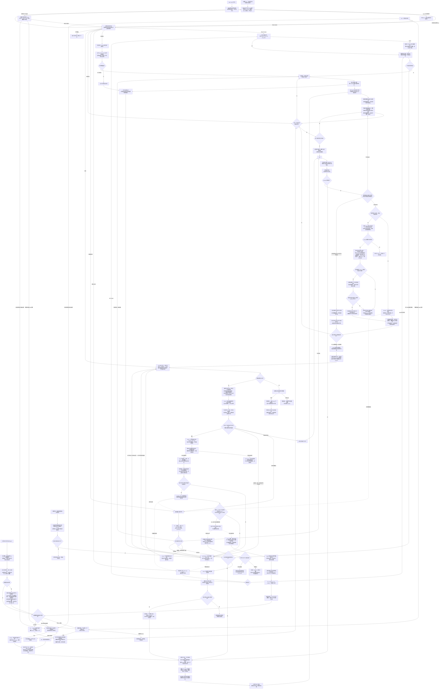

# 使用与迭代指南

适用源码工作版本：**0.8.0**（本机安装状态见维护总览）；文档核对：**2026-10-10**。本页说明当前源码用法；发布历史见 [CHANGELOG](../CHANGELOG.md)，本机安装与当前限制见 [维护总览](../MAINTAINER.md)。各版本标题或评估中的版本表示当时的规则或被测版本，不代表所有机器当前的安装版本。

## 当前执行机制

- **一个入口、按阶段加载**：Requirement、Scope、Repair、Deliver 由主 Agent 按需执行。Build 可由内部判断选择串行或两个隔离 Worker；Verify 可按明确请求派发独立只读专家。专业规则随主 Skill 安装，不需要用户安装或调用六个独立命令。
- **外部配置任务先分流**：Scope 逐任务核对实施方。若某任务只需后端等外部系统下发配置，Agent 必须在进入 Build 前说明“本项目代码改动为零”，交付精确配置项、参数、环境与实施方；配置真正下发后核对实际响应并做最小端到端观察。混合需求中的其它代码任务照常 Build。不能把文档提交说成客户端实现，也不能仅为该配置任务重复编译、无关单测、翻译检查或整套旧验收。当前判定仍靠 Agent 调查，不是脚本自动语义识别；纯配置需求若无可执行质量门，现有 check/audit 仍会阻止 complete，须如实报告限制，不能制造空测试。详见 [外部配置任务](../skills/dev/core/references/external-configuration.md)。
- **Build 任务视图与差异检查**：Worker 先 preflight，再读取本任务的 task-view，按证据扩读来源、调用方和共享行为；编辑完成后单独 inspect-diff，核对完整补丁，再单独 finish。当前补丁缺少有效检查记录时不能 ready；检查记录不证明 Agent 理解了全部语义。候选集成及采用后仍要验证实际主项目。[安装版证据](evaluations/2026-09-30-build-installed-full-diff.md)。
- **最后一项任务后的自动接续**：已授权开发完成后，总路由自动进入普通 Verify，执行适用检查；证据齐全时按 Deliver 顺序保存报告、回读并更新完成状态，然后直接告知结果。缺少真机/视觉观察、产品决定或有效检查时保留 `provisional`，只询问具体缺口；用户回复后继续原链路。单纯询问状态、激活会话、明确只读或仅检查不会擅自结项。归档、推送和 PR 均不随结项自动执行。
- **推断需求的结项口径**：`inferred` 保留来源不确定性，不等于测试未做。逐条区分有决策确认的产品规则与从既有代码推断的保护行为；无未决产品选择且每条有当前证据时可结项，但不能把整条推断需求说成已获产品确认。纯为改标签而重跑无关验收没有收益；会改变用户可见行为的未确认推断仍须澄清。
- **结项后合并复核**：先盘点原交付版本与合并后 HEAD 的差异，再调查改动路径与当前需求的调用方、依赖和检查选择。无关且有据时保留原 `complete`，不重走旧真机矩阵，也不声称旧测试是在新版本执行；相关或未知才做定向复验。要正式认证合并版仍走当前 check/audit，旧质量报告出现 stale 是准确提示，不应改摘要绕过。
- **验收范围收敛**：逐项比较实际改动、调用方和已登记依赖。发现未登记的直接或传递依赖时，保持“未知”，补登记并重新观察；即使当前只是文字变化或本地探针通过，也不得例外沿用旧结果。只有依赖完整、改动确实无关且有证据时，旧观察才可记为 `retained`，并分别标明旧测试版本和当前范围复核版本。脚本不能证明依赖清单完整。
- **Deliver 收口顺序**：保存需求目录内的 delivery-report.md → 单独全文回读并核对当前证据 → 对受控基线登记报告哈希 → 单独更新 complete → 对新建 v4 工作流再次运行 check（含当前 audit）。失败撤回完成声明并保留现场。报告注明保存时的证据截点，当前状态以权威记录为准。哈希或文件存在不代替全文回读。[正常收口](evaluations/2026-09-30-gap23.md)与[失败留痕](evaluations/2026-09-29-gap22-report-blocker.md)。
- **临时写入范围**：普通阶段使用已确认忽略的项目内 `.agent-workflow/scratch/<需求ID>/<本次目录>/`；独立 Verify 和 Worker 只使用明确授权的位置。不可写就停止相应操作，不转写其他位置。这是执行规则，不是宿主文件系统沙箱。[验证范围](evaluations/2026-09-30-write-scope.md)。

## 工作原理

1. 在目标项目执行 scan，脚本盘点清单，Agent 阅读实际代码补全技术基线。
2. 导入 PRD，保留原始字节，Agent 生成 JSON 需求、任务、决策和追溯关系。
3. 开发前结构校验。按任务实现、运行本任务必要检查并更新证据；可独立完成的任务由总路由分别本地提交。
4. 后补 API/Figma 时，推断差异可细化；一手证据冲突需记录并请用户决策。
5. 最后一项任务完成后自动核对实际构建、测试和人工证据；齐全则保存报告并结项，缺口则保留 provisional 并在补证后接续。

通用核心不要求 UI、后端或某一种语言。API/Figma 状态分别为 present / missing / unknown / not_applicable。只有业务范围不需要时才能 not_applicable，并在 feature.source_notes 中记录理由。present 表示资料存在，不自动表示已完成对齐。

产品展示名为 FeatraceDev；本次更名保持 `/dev`、`$dev` 与既有业务记录兼容。中文/英文安装入口见 [README](../README.md) / [English README](../README.en.md)。

## 可选独立复核

输入 `/dev check OGFR-1234 --independent`，或在开发模式说“对当前需求做独立复核”。系统会绑定当前资料和版本，让全新上下文的 Verify 查看需求、改动、相关调用方与测试依据，再由总路由核实发现。没有可用的独立执行能力时会明确告知。

该模式只读已有证据，不重新构建、不修改业务记录、不自动验收通过。若要执行测试，继续使用普通 `check`；需要“先测试再独立复核”可直接如此说明。临时输入/结果保留在项目外，不自动提交，来源缺失会作为未覆盖范围保留；输入版本变化时拒绝采用旧复核结果。当前为可选试点，真实节省时间和减少遗漏的效果尚未证明。

0.5.24 在派发前增加路由层核对：输入过期或无效时直接停止，保留原产物；子 Agent 的预检与返回核对仍保留。复核也须区分需求是否确认、实现是否完成和证据是否充分；恢复已确认旧行为通常是技术修复，不因决策列表为空就要求产品重新选择。逻辑测试 ID 通过用例/命令映射核对覆盖，不要求与函数同名。

## 日常工作流

适用源码版本：0.8.0；最后核对：2026-10-10。下图描述当前 Agent 工作流程；结构校验由脚本辅助，资料理解、冲突判断和最终完成条件仍需 Agent 结合证据核对。0.5.40 要求发现漏登依赖时停在未知；按项范围复核仍须有完整依赖和实际证据，旧记录保持兼容。

不记得命令时使用 `/dev help`；想区分报错修复与需求变更时使用 `/dev help fix` 或 `/dev help revise`。帮助无需选择项目或需求，不执行任何工作流操作。Codex 使用 `$dev help`。


```mermaid
flowchart TD
    HELP["help / help 命令名"] --> HELPOUT["展示说明与示例后结束<br/>无需项目或需求，不执行工作流"]
    MODE["无参数 dev：进入或查看当前会话开发模式"] --> IDLE["回复首行只显示 ON 与项目<br/>需求由 status/list 按需查看；仅激活，不写记录"]
    IDLE -->|再次输入无参数 dev| IDLE
    IDLE -->|dev off 或切换项目| MODEOFF["显示 OFF，结束当前项目会话模式"]
    IDLE -->|收到后续工作请求| BARE["普通开发描述默认 next<br/>裸 prd / status / check 等按精确命令处理"]
    BARE -->|继续已有需求| NX
    BARE -->|明确开始新 PRD 需求| NEWREADY["新需求准备：产品编号 + 可读取 PRD<br/>模块先待调查"]
    BARE -->|旧功能的独立改动/故障| LIGHTREADY["轻量变更准备：产品编号 + 原始描述<br/>模块和预期行为待调查"]
    NEXT["next + 自然语言描述"] -->|继续已有需求| NX["读取当前需求状态<br/>判断资料/澄清/修订/修复/开发/验收路线"]
    NEXT -->|明确开始新 PRD 需求| NEWREADY
    NEXT -->|旧功能的独立改动/故障| LIGHTREADY
    NEWREADY -->|缺编号或 PRD| NEEDINPUT["只询问缺失项；不初始化、不选需求"]
    NEWREADY -->|齐全| E
    LIGHTREADY -->|缺编号或描述| LIGHTINPUT["只询问缺失项；不写入无关旧需求"]
    LIGHTREADY -->|齐全| LIGHT["change：原话保存为独立来源<br/>故障先登记 reported，预期仍待证据"]
    LIGHT --> E1
    NX -->|补 API / Figma| U0
    NX -->|需求疑问| AA
    NX -->|已确认变更| RV
    NX -->|观察到异常| X
    NX -->|继续开发| I
    NX -->|验收| VIN
    NX -->|只查进度| ST["展示当前状态、阻塞与下一步"]
    A["在目标业务项目启动 Agent"] --> A1["首次使用：配置选择性 Git 忽略规则<br/>克隆接续：读取已有记录并恢复必要来源"]
    A1 --> B["首次/结构不明：建立全局概览<br/>已有模块目录：优先核对目标、调用方与依赖"]
    B --> C{"基线缺失或过期？"}
    C -->|是| D["创建扫描草稿，盘点项目与核对规则<br/>Android 生成 Gradle 候选与缺口；未知目标和条件依赖保持待审<br/>条件依赖不得压成无条件目录边<br/>校验草稿后发布，变更才备份，保留 3 份"]
    C -->|否| SEL{"创建新需求或继续已有需求？"}
    D --> SEL
    SEL -->|新 PRD 需求| NEWREADY
    SEL -->|独立轻量改动/故障| LIGHTREADY
    E["prd：保留原始需求资料"]
    SEL -->|已有需求| USE["list → use ID：校验并选择当前需求<br/>读取 status，再决定下一步"]
    USE --> MOD["定位文件/问题在已知地图或待审区域<br/>读取模块档案并核对相关文件<br/>地图外先探索，再扩大调查"]
    MOD --> I
    E --> E1["登记并核对 PRD、短报告和／或 HTML 来源<br/>核对正文、交互状态与依赖<br/>记录读取缺口，保留原文上下文"]
    E1 --> F["拆解原子需求、任务和验收条件<br/>区分产品确认与推断的旧行为保护<br/>更新 JSON 规格、决策、追溯与测试计划"]
    F --> G["判断 API / Figma 适用性<br/>不需要：记录理由；需要但缺失：记录假设"]
    G --> G1["建立条件与例外的双向覆盖<br/>回到原文复核并记录复核结果"]
    G1 --> TR["同步任务语义摘要<br/>局部核对任务与关联需求/依据"]
    TR --> H["执行 draft 校验并修正规格<br/>有待读缺口时仅登记 draft 局部复核"]
    H --> PICK["新建流程成功后选为当前需求<br/>失败保留旧选择；同会话同项目可省略 ID"]
    PICK --> MSCOPE["草稿后先用地图定位，再核对相关代码<br/>地图外记录探索缺口并建立证据<br/>推荐多模块职责；仅向用户确认产品歧义"]
    MSCOPE --> I{"存在一手来源冲突<br/>或未决决策？"}
    I -->|是| J["记录冲突、影响与选项<br/>等待用户决策"]
    J --> K["保存已确认决策<br/>修订 JSON 规格与受影响任务"]
    K --> H
    I -->|否| MODSEL{"能力与模块职责已确认？"}
    MODSEL -->|是| MODREV["复核相关模块、调用方与依赖档案<br/>过期则按证据更新"]
    MODSEL -->|否| MSCOPE
    MODREV --> IMP
    IMP --> HR["同步相关历史 verified FIX<br/>按模块与登记代码路径生成候选"]
    HR --> HRD["逐项选择重测<br/>或说明为何不适用"]
    HRD --> L{"develop 校验通过？"}
    L -->|否| F
    L -->|是| OWNER{"逐任务确认实施方与产物<br/>本项目代码还是外部配置？"}
    OWNER -->|本项目代码| PB{"内部判断：独立性、收益、容量足够？"}
    OWNER -->|外部配置且本任务本地代码零改动| EXTCFG["立即告知用户零代码与实施方<br/>交付精确配置单；待外部实际生效"]
    EXTCFG --> EXTVERIFY["核对实际下发值与最小端到端行为<br/>无配置实收则保持未完成"]
    EXTVERIFY --> MORETASKS
    OWNER -->|不明或混合| MSCOPE
    PB -->|否| M["develop：按小模块实现与自测<br/>更新任务、追溯和证据，生成 Markdown"]
    PB -->|是| PS["沿用 Scope 前置：任务语义、影响与历史复核<br/>必须有当前复核记录；缺项无写权限则停止"]
    PS --> POK{"Scope 依据齐全且有效？"}
    POK -->|否| PBL["停止在 Scope；不创建工作区或派发"]
    POK -->|是| PW["核对任务独立性与接口 → 两个独立工作区<br/>各自 preflight 后获取本任务只读视图，再按证据扩读<br/>编辑成功 → inspect-diff 全文核对 → 单独 finish；不写共享记录"]
    PW --> RET{"两份返回均 ready、证据当前且语义兼容？"}
    RET -->|否| STOPBUILD["保留双方改动与失败证据，停止当前尝试<br/>不调用 integrate 验证拒绝，不降级或自动重试"]
    RET -->|是| PI["总路由在第三个工作区集成验证<br/>失败保留候选；通过也不直接标记完成"]
    PI --> PF{"候选已通过且未变，采用前 preflight 退出 0？"}
    PF -->|否| STOPBUILD
    PF -->|是| PA["按普通授权采用完整补丁并串行更新记录<br/>旧候选不作主项目交付证明"]
    PA --> TASKCOMMIT["总路由逐项收尾：本任务必要检查 + 精确暂存与本地提交<br/>不等全部任务；不提前做完整验收或推送"]
    M --> TASKCOMMIT
    TASKCOMMIT --> MORETASKS{"还有已确认且可继续的任务？"}
    MORETASKS -->|是| I
    MORETASKS -->|否；或仅剩验收，自动继续| HRC["Verify 前刷新历史候选<br/>候选或范围变化则旧结论失效"]
    HRC --> HRE["新建历史回归记录：逐项登记 planned_checks 的结果<br/>未执行的检查不能整体记为 passed"]
    HRE --> VIN["Verify 输入核对：只读列出来源、补充资料、Git 改动<br/>和已有质量报告对应版本；不作通过判定"]
    VIN --> IV{"明确要求独立复核？"}
    IV -->|是| IP["总路由派发前核对已准备输入"]
    IP -->|过期/无效| IS["路由停止：保留产物与阻塞原因<br/>不启动独立 Agent"]
    IP -->|有效| IR["绑定输入 → 独立 Verify 只读调查<br/>宿主不支持则报告不可用"]
    IR --> IC["核对输入是否变化与发现依据<br/>返回复核结论；不自动验收或写业务记录"]
    IV -->|否| SCOPEV["逐项核对真实 diff、调用方与完整依赖<br/>发现漏登直接/传递依赖 → 未知并重新观察<br/>受影响重测；真正无关且有据才保留旧观察"]
    SCOPEV --> N["check：执行所选历史回归和本次验收<br/>记录当前版本、方法与证据"]
    N --> MAN["列出剩余人工步骤，收集实际观察<br/>核对版本、范围、过期证据与整体门禁"]
    MAN --> O{"检查与产品权威是否支持交付？<br/>推断约束逐项标明依据"}
    O -->|发现效果偏差| X["发现效果与需求不符"]
    O -->|其他检查失败| P["修复检查或补齐记录"]
    P --> IMP
    O -->|未配置、缺人工证据或环境不可用| Q["provisional：记录具体缺口与下一步<br/>用户补证后自动接续，不宣称完整交付"]
    O -->|通过| DR["Deliver：保存需求目录内 delivery-report.md<br/>结论注明证据截点，等待保存成功"]
    DR --> DREAD["单独全文读取已保存报告，等待成功返回<br/>截断则读完剩余部分；失败不得完成"]
    DREAD -->|失败或未补齐| DBLOCK["provisional：可写时单独保存真实阻塞报告<br/>不可写则说明留痕失败，保留现场"]
    DREAD -->|全文返回成功| DCOMP["Agent 核对版本、覆盖、证据与限制<br/>确认报告结论在完成后仍真实"]
    DCOMP --> RB["受控基线：核对版本绑定检查与实际验收<br/>登记该版本的交付证据；普通需求沿用原流程"]
    RB --> R{"报告已保存复核且完成条件全部满足？"}
    R -->|否| Q
    R -->|是| S["complete：另一步更新状态<br/>更新相关模块档案及历史需求引用"]
    S --> FINALCHECK{"新建 v4 工作流：状态更新后再运行 check<br/>非空报告及当前 audit 均通过？"}
    FINALCHECK -->|否| Q
    FINALCHECK -->|是；旧工作流沿用原规则| DONE["向用户报告完成结果与证据边界<br/>不自动推送或归档"]
    DONE -.->|用户选择归档| AP["archive 预检：保留已有报告；缺失则从现有记录生成待审草稿<br/>提示模块候选、来源保存状态与证据缺口"]
    DONE -.->|结项后合并| PM["只读盘点交付版本到合并后 HEAD 的全部改动<br/>不因 HEAD 前进自动重开或重跑完整 check"]
    PM --> PMR{"影响已交付行为或其依赖？"}
    PMR -->|有据无关| PMKEEP["保留旧 complete 与原测试版本<br/>报告合并版本的范围复核；不冒充新测试"]
    PMR -->|相关或未知| PMTEST["调查并仅重验受影响项<br/>认证合并版本时走当前 check/audit"]
    AP --> AR["Agent 审阅报告并移除草稿标记后<br/>原地标记归档，保留历史，活动列表隐藏"]
    AR --> GS["报告未跟踪/未提交/忽略的共享记录<br/>归档不等于已提交或推送"]
    GS --> HIST["list --archived / --all --module：查看相关历史"]
    HIST --> RES["继续原需求：restore 后工作<br/>新需求：新建 ID 并引用相关历史"]
    RES --> SEL
    Q -->|补齐环境或检查配置| VIN
    Q -->|用户回报人工验收或决策| VIN
    RV["revise：描述修订或提供补充来源"] --> RP["按需登记已确认基线<br/>保存修订前后值、依据与影响清单"]
    RP --> RC{"决策已确认且版本/原值匹配？"}
    RC -->|否| RH["保留待决或显式取消<br/>不覆盖当前需求"]
    RC -->|是| RA["应用修订：推进确认版本，保持 provisional<br/>同步任务与来源映射，回读并复核"]
    RA --> F
    T["任意阶段：新 PRD / API / Figma<br/>或需求修订到来"] --> TS{"资料类型？"}
    TS -->|API / Figma| U0["一次登记来源文件<br/>同步 intake sources 与 prd_paths"]
    U0 -->|Figma| UI["按文件+节点 ID 定位页面状态<br/>新节点或截图只列候选，歧义请用户确认"]
    UI --> U
    TS -->|PRD / 修订附件| U
    U0 -->|API| U["保留新版本来源，逐项对齐<br/>分析受影响需求、代码和测试"]
    U --> V{"一手来源互相矛盾？"}
    V -->|是| J
    V -->|否：补全或细化推断| VC{"已启用基线且改变需求含义？"}
    VC -->|是| RV
    VC -->|否| F
    Q -.->|等待资料补充| T
    S -.->|后续需求变更| T
    AA["任意阶段：clarify 或实质需求疑问"] --> AB["复用 decisions.json 登记待澄清事项<br/>查原始来源、旧决策、相关代码与影响"]
    AB --> AC{"已有明确依据？"}
    AC -->|有| AD["记录已有规则及证据"]
    AC -->|需产品取舍| J
    AD --> AE["同步受影响记录<br/>列出实现及重验范围或无需修改的理由"]
    K --> AE
    AE --> VC
    M -.->|发现效果偏差| X
    S -.->|交付后反馈| X
    X --> Y["fix：登记描述、预期／实际、复现与证据<br/>已有 complete 转为 provisional"]
    Y --> Z{"核对原始资料后归因"}
    Z -->|非缺陷／已确认撤回／重复| C1["closed：记录处置理由与证据<br/>重复项关联原报告，继续检查原问题"]
    C1 --> VIN
    Z -->|代码缺陷| IMP
    Z -->|原文误读| VC
    Z -->|需求变更／来源冲突| J
    Z -->|环境缺口| Q
    TMPREQ["任意阶段：需要临时提案或试验副本"] --> TMPLOC["先选择并传递授权写位置<br/>普通阶段用已忽略项目scratch<br/>复核和Worker沿用已授权分配位置"]
    TMPLOC --> TMPALLOW{"位置在授权范围且可写？"}
    TMPALLOW -->|是| TMPDO["使用本次独立目录，继续当前阶段"]
    TMPALLOW -->|否| Q
```

读图时注意：

- **一个入口，六个内部阶段**：0.5.17 将现有流程组织为 Requirement、Scope、Build、Verify、Repair、Deliver。路由器先读当前需求状态，再只加载本阶段及直接前置规则；阶段结果写回已有需求、任务、影响、修复、验证和交付记录，不新增通用交接文件。0.5.19 的 Verify 输入核对只暴露可读取的事实与版本差异，退出码 0 不表示验收通过。默认由同一 Agent 执行；0.5.23 可显式选择独立只读 Verify，宿主需支持全新上下文。它不自动执行测试或认定交付。Build 在独立性、收益和宿主能力满足时可派发两个隔离 Worker；Requirement、Scope、Repair、Deliver 仍由主 Agent 按阶段加载。

- **任务完成就提交，验收另行进行**：总路由在每个已完成且可独立暂存的 Build 任务后，核对实际差异、运行本任务必要检查、更新任务与追溯记录，然后仅暂存该任务并创建一笔本地提交；不等所有任务结束，也不为提交重复运行整项需求的 check/audit 或真机矩阵。提交说明使用“类型（需求 ID／任务 ID）：实际结果”，正文写原因、已运行检查和仍待完成的验收。并行 Worker/集成候选不直接提交；采纳到主项目后由总路由逐项提交。已有他人暂存内容、混杂修改或仓库禁止自动提交时，保留现场并说明阻塞，不强行合并成一笔。最终 Verify/Deliver 仍针对实际交付版本执行，可能另有记录收口提交；提交不等于 complete，也不自动推送。仓库既有的 Git 钩子仍会在每笔提交时运行，其耗时需在真实项目中观察。

- **专业 Agent 简短交接**：Build Worker 和独立 Verify 给总路由的文字回复统一为“状态、结果、检查或证据、风险或缺口、下一步”。详细补丁、检查日志与全部复核发现继续保存在原有结构化返回中；总路由先逐项核对，再向用户发一份综合摘要，不转发多份流水账。此约定不隐藏失败，也不把 `ready`、`reviewed` 解释为整项需求通过；宿主界面自行展示的工具过程不受这条文案规则控制。

- **日常统一入口**：已有需求选中后，可直接用 `/dev next <你现在要做的事>`。Agent 先说明路由，再执行原有流程；不只是返回一条命令建议。明确说“开始新需求”也可触发原有 `prd --feature` 流程：先显示“编号 / PRD / 模块待调查”，仅追问缺失的产品编号或可读取 PRD；两者齐全便自动继续，不要求用户猜代码模块。完成 draft 后由 Agent 根据地图、代码和调用方推荐模块职责；有产品归属歧义才询问，未确认的范围仍阻断开发。新会话继续已有需求仍需 `use`。图片是设计素材还是故障截图，按它的用途而非文件类型分流。Claude Code 可输入 `/dev` 进入当前会话、当前项目的开发模式；随后普通开发描述默认走 `next`，也可直接输入裸命令词。模式内每次回复首行只显示 `FeatraceDev ON · 项目：…`，不反复展示选中需求；输入 `status` 可查看当前需求和进度，输入 `list` 可查看可选需求。不确定时再输入一次 `/dev`，只刷新模式提示，不扫描或开发。`dev off` 显示 `FeatraceDev OFF` 并退出；切换项目或新会话后需重新进入。该提示由 Agent 生成，不是 Claude Code 的持久状态灯；状态不写文件，也不保证跨上下文恢复。Claude Code 的 `/status` 是内置命令，需求状态请输入普通文字 `status` 或 `/dev status`。“还有哪些问题”“是否完成”等只读提问仅查看现有状态和证据，不自动重跑构建、check 或 audit。

- **轻量变更入口（0.8.0 源码）**：已有功能的独立改动或无所属旧需求的故障，可给产品编号和一句原始描述，不必先写完整 PRD，也不要求用户猜模块。Agent 先查是否真有可继续的旧需求；若没有，则在项目内已忽略 scratch 保留用户原话，用 `init-change.py` 创建普通草稿。故障先记为 `reported/unclassified`，原话中的现象不自动成为“应该怎样”的产品批准。随后仍须调查模块、代码和旧行为，完成来源/语义复核、影响分析、历史修复核对、开发与适用验证；与旧档案有关联时在新记录中引用，旧档案不因代码重叠被改写。已有 ID 不覆盖；无产品 ID 时只问 ID。`change` 是入口，沿用既有数据和门禁，不提供快速跳过验收的通道。当前真实项目自然采用尚未验证。

- **归档预检**：`archive` 先运行只读校验并检查交付报告。缺报告时只从现有 JSON、质量结果和验收记录生成带待审标记的草稿；Agent 必须核对门禁是否真的覆盖该需求、人工证据和已验收版本，移除标记后才能归档。模块候选不会自动分类，ignored/untracked sources 不会自动上传。

- **归档与 Git 分开**：归档后报告共享记录保存状态，渲染视图后再核对最终改动。审阅后将记录随对应代码分支提交；推送另需授权。本机日志/来源按共享规则处理，不自动全部上传。未跟踪文件不会因切换分支自动隔离。

- **模块档案与能力图**：Android 初次 scan 会从常见静态 Gradle 声明生成 `modules/candidates.json`/`.md`，列出文件/行号依据和未解析缺口。它只帮助人工建立目录，不会自动确认模块、职责或运行时调用；动态 Gradle 配置仍需阅读。0.5.20 会对外部 settings 加载和 `add(..., project(...))` 依赖给出带行号的人工复核提示；0.5.21 将未被静态 include 的依赖目标保留为待审节点与虚线边，并把可识别的变体专属依赖另列为条件候选。若正式目录把仅条件生效的关系写成无条件依赖，关系图和扫描发布会拒绝，需人工修正。确认后的代码模块目录生成 `modules/graph.json` 与 Mermaid `graph.md`，候选依赖为虚线，人工声明依赖和已确认职责为实线；`/dev scan --module wallet` 聚焦登记的目标模块、直接调用方和依赖。新需求使用用户提供的产品编号，PRD 分析后由 Agent 推荐业务能力及各模块的 owner/host/provider/consumer/shared 职责，再让用户确认歧义。红包可以是业务能力，同时由 wallet 拥有规则、chat 承载展示，不强制归为单一模块。图不是完整运行时调用图。详见 [模块规范](../skills/dev/core/references/module-context.md)。

- **持续探索与跨模块定位（0.5.41 源码）**：发现陌生文件或别的模块的问题时，内部只读定位入口先查已登记模块及其档案状态，再查有效的 Gradle 待审候选；现有文件未命中则明确标为地图外。项目级规则/构建证据另列，不误报为地图外；仅有问题描述时可作字面检索，再查实际代码。地图外不代表无主或可直接修改；Agent 扩大代码/调用方调查后，才把有证据的新边界与行为写入受影响的目录和档案，留存未解缺口。共享文件经审阅随代码提交；队友可读取同一地图，但同时修改同一档案仍需 Git 合并和重新复核，不能自动覆盖。此能力的路径定位有合成测试，真实项目采用率与检索准确性尚未测量。

- **验证列表与范围复核**：check 整理需求验收条件、影响行为和已选检查；可执行项自动运行，剩余项提供操作与预期。构建通过不等于页面验收通过。代码变化先使列表证据过期；已登记依赖的保留行为，可在逐项核对完整 diff 后保留旧观察，明确标 `retained`、旧被测版本和当前复核版本。可点击文案、导航或共享逻辑依赖变化不得免测；未知按受影响处理。未实现自动语义判断或全部验收项的精准依赖图。操作细则见 [验证流程](../skills/dev/core/references/verification-workflow.md)。
- **已结项需求的合并复核**：Agent 从已接受报告确认完整交付 SHA，运行内部只读差异盘点，逐路径核对实际改动和调用/状态依赖。纯工作流提交可直接说明没有项目路径变化；其它变化须调查，不能凭目录不同判无关。证明无影响时原需求保持 `complete`、原检查绑定旧版本，不要求为状态展示重走完整验收。相关或未知时做针对性复验；如果要把合并后的构建重新认定为可交付，必须执行该版本适用的正式质量门和 check/audit。详情见 [合并后复核](../skills/dev/core/references/post-merge-review.md)。

- **影响清单**：现有命令不变。0.5.6 新建需求默认要求 Agent 在改代码前维护 impact.json；未决行为阻止开发，范围外改动、缺失或过期回归证据阻止 check。旧需求仅在继续改代码时采用；脚本不会自动发现全部关联。具体记录与兼容边界见 [影响核对](../skills/dev/core/references/impact-review.md)。

- **历史修复回归提醒**：无需新增命令。develop/fix/revise 在业务代码修改前同步当前模块与登记代码路径相关的历史 `verified` 修复；同步只发现候选，用户要求只同步/列出/停止时保持 pending。获得判断授权后，Agent 对每项选择重测，或写明本次为何不适用。check 前再次同步；候选、范围或历史修复内容变化会使旧结果失效，并把旧 disposition/result 保存到只读 history，历史项不能放行当前门禁。新建 schema v3 记录要求每条计划检查分别写结果、方法与证据；未测的步骤不能整体写 passed。旧版记录保持可读。原历史 FIX 状态不变。候选依赖已有模块和路径登记，遗漏的依赖仍需人工扩大调查。详见[历史回归规范](../skills/dev/core/references/historical-regression.md)。

- **任务语义局部复核**：无需新增用户命令。生成任务或修改任务标题、描述、范围、依赖、关联需求等含义后，Agent 同步 task-review，并只读取变化任务、新旧关联需求及相关来源/决策/修复证据。状态、测试证据、验证结果、实现版本、时间和负责人变化不触发。摘要发现内容变化但不判断新文字是否正确；复核依据和旧版本保存在 task-review.json。详见[任务语义规范](../skills/dev/core/references/task-semantic-review.md)。

- **API、Figma 不是必经依赖**：功能不需要时记为 `not_applicable` 并说明理由；需要但尚未提供时允许有据可查的暂定实现，不允许宣称完整交付。
- **新证据随时可进入**：已有功能直接读取其记录并走“保留新版本 → 对齐 → 更新规格”分支，不重复初始化。API/Figma 的本地导出或证据清单通过登记脚本一次同步 intake 与 `prd_paths`；登记后仍需逐项阅读和映射。Figma 新来源会启用轻量页面/状态索引：同一页面的多个状态分别登记；文件 ID + 节点 ID 可精确找回已登记状态，只有描述、截图或新节点时仅列候选，仍有歧义则先请用户确认。来源文件字节变化会使相应索引失效，但脚本不自动拉取远端 Figma，也不证明画面语义变化。每次来源、需求、决策含义或任务语义变化后，必须在继续改代码前重做必要复核并运行 develop 校验。
- **冲突先决策**：当前 develop 校验会在任一需求 blocked 时阻断整个功能的编码；可以继续无关分析和文档工作，但不能把任务级自动隔离当作已实现能力。
- **Deliver 报告位置和顺序**：授权收尾后先核对既有 check/audit 与实际覆盖，再将报告保存到 `.agent-workflow/features/<ID>/delivery-report.md`；报告结论注明保存时的证据截点，不把随后执行的回读、版本登记和状态更新写成永久待办。单独全文回读，确认结论在完成后仍真实；受控版本先登记已读报告哈希，最后另一步标记 complete。新建 v4 工作流在状态更新后再次运行 check，要求报告非空和当前 audit 通过；失败撤回 complete。外部摘要或聊天回复不替代项目内报告；缺失/过期/失败证据保持 provisional。写报告不自动重跑测试，不冒充用户/真机验收，也不隐含提交推送或归档。脚本只核对可计算条件，报告文字真实仍由 Agent 核对。
- **通过校验不等于 complete**：还需核对有效需求已确认、任务完成、无未决冲突、必要资料已对齐或合理不适用、追溯与测试证据齐全、适用质量检查实际通过。未满足时保持 provisional，并列出待办。
- **修复要留证据**：效果偏差登记到同一功能的 fixes.json，生成 fixes.md；初始原因可待查，任务描述遗漏与代码缺陷可共同记录。未验证且未有效关闭的问题阻止功能级 check；非缺陷、撤回和重复按修复规范记录 closed，不能替代原问题修复。代码 bug 不自动改变 PRD，需求变更和来源冲突须有来源与已确认决策。
- **恢复进度用 status**：Claude 输入 `/dev status FEAT-001`，Codex 输入 `$dev status FEAT-001`，先读取已有状态，再决定开发、补资料或检查；无需重走所有步骤。

### 选择当前需求

```text
/dev list
/dev use FEAT-001
/dev develop
/dev fix 返回后表单被清空
/dev clarify 返回应去哪里
/dev check
/dev status
```

常规开发不需要背诵上述全部精确命令。选中需求后可直接说：`/dev next 我补充了一批图片，路径是……`、`/dev next 返回后表单被清空`或 `/dev next 继续开发`。无描述的 `/dev next` 会先读状态，只在下一步唯一且已获授权时执行；否则只追问会影响产品权威的必要信息。若已用 `/dev` 进入开发模式，上述三句可直接写成“我补充了一批图片，路径是……”“返回后表单被清空”“继续开发”。

新建仍可用 `/dev prd /path/to/prd.md --feature FEAT-002`，也可在会话模式直接说“开始新需求，编号 FEAT-002，PRD 在 /path/to/prd.md”。入口先显示 `新需求准备 · 编号：FEAT-002 · PRD：/path/to/prd.md · 模块：待调查`；缺编号或无法读取 PRD 时只问缺失项，不创建半成品。完成分析、渲染和 draft 校验后自动选中，再调查并推荐模块职责；失败或 ID 已存在时保留旧选择，已有内容不覆盖。`use` 只选择已有需求，不创建需求。切换时摘要上一需求未完成事项，并显示新需求的名称、状态和下一步。

旧功能的独立修改可说“`change --feature FEAT-003 钱包入口改名，点击逻辑保持不变`”；无对应旧需求的故障可说“`fix 付款按钮连点时扣了两次款，产品编号 FEAT-004`”。Skill 会先核对是否真无所属旧需求，再保存原始报告并创建新工作项。只输入 `fix` 没有问题描述仍不足以登记；已有需求内的故障继续在原需求下记录 FIX，不另建工作项。短报告可以先建档，但若无法从原话与现有证据确定期望结果，必须停在待澄清，不能直接改代码或标完成。

当前选择仅保存在当前会话、当前项目的上下文中，不写共享指针；新会话或选择丢失时重新选择。每次操作显示项目、ID、名称并校验记录。显式 ID 只对该次命令生效，不改变默认选择。底层脚本仍传明确 ID；多会话隔离依赖 Agent 遵守会话范围，并非主机插件提供的持久会话状态。`scan`/`list` 不需选需求，`status` 不会暗中切换，`use` 不切 Git 分支。详见[选择规则](../skills/dev/core/references/feature-selection.md)。

### 已确认需求的修订

```text
/dev revise FEAT-001 返回时需要保留表单，按已确认结论更新验收条件
/dev revise FEAT-001 根据补充说明调整返回行为 --source /path/to/补充说明.md
/dev status FEAT-001
```

原始 PRD 保持不变，当前 requirements.json 应用已确认修订后更新；修订另存 revisions/CHG-*.json，生成 revisions.md。新到资料不因时间较晚自动生效。Agent 区分代码 bug、原文误读、细节澄清和产品变更，复用已有决策依据，无需对已经确认的要求重复询问。

旧需求按需启用：先核对原规格已确认且完整复核，再登记基线 1；不批量迁移，不把旧 complete 自动认定为版本化验收。登记基线后，已有 complete 会转 provisional，待当前代码重新完成版本绑定验证。原历史报告保留。每次修订只修改指明字段；旧版本或修改前值冲突时停止覆盖。同一需求先只允许一项待确认/待落实修订。

确认版本推进不代表代码完成。应用后同步任务、相关实现及 PRD 读取映射，重新复核；项目检查使用 `project.py check <PROJECT> --feature <ID>`，实际验收后用 revise.py verify 登记版本、代码提交与报告哈希。该登记不自动设置 complete。状态可显示“确认 v2、已验收 v1”；旧测试报告不能直接证明新版本。原文/新证据的语义与实际验收仍由 Agent 和用户核对。详见[修订规范](../skills/dev/core/references/revision-workflow.md)。

### 需求归档与按模块查找

```text
/dev classify OGFR-2577
/dev archive FEAT-001
/dev list
/dev list --archived
/dev list --all --module wallet
/dev restore FEAT-001
```

归档仅适用于已完成并有真实交付依据的需求。Agent 核对验收报告及代码版本后登记；原目录、原文、修复、决策和证据保留。默认 list 显示未归档需求，历史按需读取；不会为了归档扫描全项目。新工作流的 classify 保存业务能力和多模块职责，变更旧标签会使已确认职责回到 pending，防止错误沿用；旧记录的多选标签继续兼容。

归档状态与 complete 独立，恢复不改历史验收；继续开发、修复或澄清前恢复。模块标签查找需求历史；0.5.4 模块档案另行记录当前技术和功能细节，使用前核对实际代码。归档检查包含已采用的新门禁，旧验收与当前工作树不一致可能被阻塞，不能刷写证据强行归档。暂不提供压缩删除、规则自动取代或完整增量扫描保证。详见[归档规范](../skills/dev/core/references/feature-archive.md)。

### 需求疑问、补充与影响分析

`/dev clarify FEAT-001 疑问或提议` 将事项记入现有 decisions.json 并返回 D 编号。Agent 先查原文、历史决策和代码，区分解释、遗漏、冲突与新增变更；影响旧功能时核对需要改变及保留的行为。产品取舍未明确则保持待决；已有明确确认不重复询问。普通讨论中的实质问题在 Skill 已加载时同样留痕，纯解释或明确要求仅讨论的内容不自动登记。

待决事项沿用整个功能的 develop/check 门禁。已确认但未落实的事项可进入开发、不能通过最终 check；落实不等于真机验收通过。已有 complete 登记新澄清后转 provisional，不自动恢复。发生实际效果偏差时转 fix 并关联同一决策。字段契约见 [澄清流程](../skills/dev/core/references/clarify-workflow.md)。这不保证自动识别所有普通对话，也不实现完整 PRD 版本传播。

### 当前规则的已知缺口

0.4.6 已检查修复测试的需求/任务关联，跨范围测试须逐项说明原因，并提供非缺陷关闭路径；说明本身不证明覆盖真实。历史 verified 也不代表当前改动已回归；PRD 复核摘要不覆盖子任务描述变更。使用时仍需核对实际证据，不能用 FEATURE_VALID 代替业务验收。上述缺口与后续安排见 [路线图](../ROADMAP.md)，当前流程图不把待实现规则画成已有流程。

### 流程图维护约定

本节是日常流程的统一可读入口，与 `skills/dev/SKILL.md`、脚本实现及 `MAINTAINER.md` 中的实际限制保持一致。修改命令、状态、资料适用性、冲突处理或质量门禁时，在同一次改动中同步检查并更新本图、说明和核对日期；未实现能力只写入 ROADMAP，不画成现有自动流程。这里的“同步更新”是维护约定，并非自动生成机制。

## 不同格式 PRD 的一致性处理

`/dev prd` 保留单文件调用，也可重复指定 `--source` 添加文档或 HTML；Agent 按统一分析规范读取不同风格的 PRD，不要求产品重写模板。后补 API/Figma 时，Agent 先把可访问导出或包含精确链接、节点和版本的证据清单保存为本地文件，再由 `register-source.py` 以 `api` 或 `design` 类型登记；脚本同时更新两处来源索引，避免手工双写。

- `spec/prd-intake.json`：读取单元、原文摘录、上下文、关联条目、条件/例外覆盖及复核记录。
- `design-index.json`：启用 Figma 来源后，按逻辑页面和状态保存精确节点链接、对应需求、已读单元及来源版本；这是局部索引，不是整份设计稿的 JSON 转写。格式与改稿匹配规则见 [设计索引规范](../skills/dev/core/references/design-index.md)。
- `spec/prd-analysis.md`：生成的可读分析视图，方便查看缺口和映射。
- `requirements.json`：仍是唯一业务规格，每条有效需求以 `source_item_ids` 关联原文条目。

资料读取状态与业务未知信息分开：图片打不开是读取缺口；原文没有定义超时是未说明；功能没有 UI 才可能不需要设计稿。规则、示例、建议、背景和待定内容也分别记录，避免把举例当成强约束。

开发前会检查清单完成、读取缺口已处理、来源条目有去向、需求有反向关联、条件/例外映射已复核。复核后来源字节、条目或需求语义改变，会使复核失效；任务进度变化不要求重复阅读 PRD。复核摘要仅用于本地新鲜度检查，不等于第二步的完整来源版本管理。

复核登记由 Agent 完成，不需要用户每次批准。待决来源条目或无法读取的单元可用 `review-prd.py --stage draft` 登记已读部分和缺口；这份局部复核不能用于 develop/check。缺口解决后重新回读原文并登记完整复核。重大歧义仍按冲突流程询问；当前读取缺口和冲突门禁是整个功能级别，尚未实现局部任务隔离。脚本无法证明原文是否全部被枚举、摘录是否准确或语义是否理解正确，因此仍需回读原文核对。

升级已有 0.3 工作区时，保留原文件并补充 `prd-intake.json` 和 `source_item_ids`，实际复核后登记。可以查看状态和渲染原记录；draft 会提醒缺失，develop/check 会阻止未经复核的继续开发。不要重新执行初始化覆盖旧工作区。字段格式和操作顺序见 [PRD 分析规范](../skills/dev/core/references/prd-analysis.md)。

## 项目质量配置

scan 先在草稿中生成或保留 `quality-gates.json`，发布后位于 `.agent-workflow/project-baseline/quality-gates.json`；首次生成时 gates 为空。Agent 根据项目 CI/构建文件填入命令，不凭语言猜测命令。示例：

```json
{"gates":[{"name":"unit","command":["python3","-m","unittest","discover"],"cwd":".","timeout_seconds":600}]}
```

候选检查保存在 `quality-candidates.json`，其中的条件与模板供 Agent 选择参考，不会被执行器运行。每次 check 前按本次改动、项目规则和已有授权选择具体命令，填入 `quality-gates.json`；不要重复选择整套 preflight 与其子检查。

每个列出的 gate 都必须通过。命令参数数组避免 shell 拼接；这些命令仍会执行项目代码，需在执行前核对。脚本生成 quality-report.json，Agent 将本次结果及限制写入功能 delivery-report.md。未配置、缺运行环境或测试失败不算通过。

scan 结束使用 `project.py validate-gates <PROJECT>` 只校验配置。字符串命令、未填模板参数和不支持的 `when` 等字段会报错；空清单会明确提示待选择，不能作为质量通过。此校验不验证 Gradle 任务实际可运行。已验证修复的回归测试应由相关实际执行命令在 `test_ids` 中登记；只声明测试 ID 而命令未选择它，仍属人工记录错误。

基线包含 `coverage.md`（模块分析范围/证据/待补项）、`evidence-files.json`（实际引用的规范、配置和示例路径）。根目录 AGENTS.md/CLAUDE.md 与登记的证据进入 v2 指纹。verify 会分别列出 HEAD、清单、登记证据以及 staged/unstaged/untracked 的非 workflow 路径；工作树路径被发现后仍需 Agent 判断影响。忽略文件和跨模块语义关系不会因此自动发现。

## 兼容和迁移

- JSON 项目继续使用原路径；0.4 新增读取与覆盖复核门禁，旧工作区在继续开发前需要补全上述证据，不自动宣称已迁移。
- 旧 missing/unknown 必须逐项判断适用性，不能机械替换为 not_applicable。
- 0.4.1 要求每个实际检查有唯一 name；旧配置中的字符串命令和条件字段需迁移，条件/模板移到候选文件，再选择具体命令。
- 新 scan 使用 v2 清单与登记证据指纹；旧指纹验证会过期，重新扫描并审查基线说明。
- migrate-workspace.py 仅创建 migration_required 脚手架；保留旧 YAML，不自动理解转换。遇到任何已有 JSON 目标都拒绝写入。迁移时由 Agent 逐条重建并核对来源与决策，再清除 migration_required、验证及渲染。
- render-workspace.py 会覆盖生成 Markdown。旧手写 Markdown 先保存在迁移备份中，不能丢弃其中未结构化的决策。

## 安装分发

当前选择“克隆 + 一个 Python 安装命令”：不依赖远程安装服务，也不需要维护两份 Skill。安装器把同一个 skills/dev 完整复制到个人发现目录。更新需 git pull 后再次运行 --update；不是自动同步。

仓库地址：[P3rryW4ng/featrace-dev](https://github.com/P3rryW4ng/featrace-dev)。代码提交到远端后，给使用者发送仓库 README 即可。Codex 用户也可请求内置 skill-installer 安装仓库中的 skills/dev（访问私库须授权）；本仓库测试覆盖的是本地安装脚本。

## 维护交接

对其他 Agent 说：

> 继续维护 FeatraceDev（仓库 featrace-dev）。先读 PRODUCT.md、MAINTAINER.md、ROADMAP.md、docs/decisions/architecture.md、docs/validation.md，再核对 CHANGELOG.md 和 skills/dev/SKILL.md。核对实现与文档；只实施当前明确授权的下一项，不改变既定原则。脚本变更运行完整回归，发布时更新版本和变更记录；纯文档修正检查一致性与链接即可。更新交接状态，报告实际验证及限制。

Git 管理本体；项目 .agent-workflow/ 另行管理。聊天分享链接只是背景，不能替代可运行代码和交接文档。

## 扫描文件保留（0.4.2）

`/dev scan` 由 Agent 执行“核对 verify 的原因/路径 → 创建草稿 → 阅读与更新 → 校验并发布”。正式基线固定一份，内容变化时保存旧版本，默认保留最近 3 份程序管理的历史快照；无变化不创建备份。经审阅后若只有 Git HEAD 更新、基线正文和其他指纹均未变化，只刷新指纹且不备份相同正文。扫描失败保留旧基线，草稿可继续修改。扫描期间已登记的项目内容或正式基线变化，会拒绝发布过期草稿。

备份中的 `PINNED` 空文件可保护重要快照，受保护版本不计入 3 份上限。旧手工备份、安装备份，以及 PRD、任务、决策和开发记录均不在清理范围。该策略从新版生成的托管备份开始生效，旧备份不会自动减少。

程序接口与恢复步骤见 Skill 内 `core/references/project-baseline.md`。校验通过只证明结构和配置符合要求；分析内容仍需回读证据，不等于已实现完整增量扫描或语义准确性保证。


## Git 提交与换机接续（0.4.3）

在业务项目中，Agent 首次使用或采用此规则时运行 Skill 内的 `core/scripts/setup-workflow-git.py <PROJECT>`。它只配置 `.agent-workflow/.gitignore`，不自动提交或上传；已有规则保留，已跟踪的本地文件或上层整目录忽略会提示核对。

- 提交经过审阅的当前基线、共享配置/候选检查，以及需求、任务、决策、追溯与交付结论。
- 忽略指纹、当次检查选择/原始运行报告、草稿、锁和备份。忽略规则不能取消已有跟踪，也不能清除历史。
- 原始 PRD/API/设计来源默认忽略，按仓库权限逐项决定共享。规格、intake 引文也可能包含保密内容，需要一起审阅。未随 Git 共享的必要来源须通过授权渠道恢复，不能凭分析摘要冒充原文复核。
- 换电脑克隆后，先读取已有记录。缺少本机指纹时创建扫描草稿、复核当前证据并发布；有效说明保留，检查命令按新环境选择。脚本不保证免除读取或完整增量扫描。

完整目录规则、精确放行例子和恢复流程见 [Git 协作规则](../skills/dev/core/references/git-sharing.md)。Skill 仓库本身继续忽略整个业务 `.agent-workflow/`，不要将业务项目模板替换到 Skill 仓库根目录。


## 文档与 HTML 组合输入（0.4.4）

可只给文档、只给 HTML，或在第一份资料后重复使用 `--source` 加入其他文件。示例：`/dev prd requirements.md --feature FEAT-001 --source prototype.html`。对应初始化脚本为 `init-feature.sh FEAT-001 requirements.md <PROJECT> --source prototype.html`。两部分共同构成同一需求的证据；缺少一种类型本身不算缺口。

Agent 逐份登记阅读单元。对于 HTML，实际可观察的交互记录触发动作、操作前后状态、定位点和观察方式；无法运行的依赖、不可访问的状态或未读内容记录为缺口。示例数据不直接写成已确认业务规则。文档与交互矛盾时，关联两个来源并留下待决事项。开发前校验会检查每个登记来源都有阅读单元、HTML 有交互单元或静态范围说明、已观察交互具备字段及复核是否过期；不会自动判断交互是否被完整穷举或事实是否正确。


## 效果偏差与修复（0.4.6）

输入 `/dev fix FEAT-001 <问题描述>`（Codex 为 `$dev fix`）。Agent 先用 `record-fix.py` 在已有功能下生成 FIX 编号和 fixes.json，立即生成 fixes.md；用户只给问题描述时，预期、实际与根因可以先留空，不伪造事实。原本标为 complete 的功能会回到 provisional。之后查原始来源、运行表现和现有实现，关联需求、任务、决策、代码及测试。

核对原始资料、已确认决策、生成的子任务与代码后，再分类为代码缺陷、任务描述缺口、原文误读、真实需求变更、来源冲突或环境问题；可记录主因和附加成因。代码缺陷只修实现和回归测试；误读需重审原文与需求映射；需求变更和来源冲突要保留新来源，并关联已确认决策与确认依据。更新 JSON 后运行 render-workspace.py 生成 fixes.md。修复记录标记 verified 前要填预期/实际、原因、处理方式、观测证据、验证结果与被测代码版本，并关联受影响需求/任务的回归测试，跨范围逐项说明覆盖原因，或写明豁免理由；脚本只检查结构和关联，不判断根因或测试真假。

进行修复时 develop 校验只提示未关闭问题；功能级 check 会拒绝既未验证、也未有效关闭的修复记录；重复报告关闭后，未解决的原问题仍阻断检查。项目检查仍可单独运行以收集证据；为运行了已登记回归的检查项填写 `test_ids`，检查命令要实际选中对应测试。完成验证后运行 `audit-delivery.py <PROJECT> <FEATURE-ID>` 比对已通过的检查、修复回归 ID 与项目快照，再人工核对任务/决策、测试断言、未登记代码变化和最新交付报告，最后运行功能级 check。既有工作区没有 fixes.json 时保持兼容。0.5.0 已提供可选语义基线与修订登记；完整来源版本管理与自动影响分析仍在后续阶段，详见 [修复流程](../skills/dev/core/references/fix-workflow.md)。

例如用户已明确“B 页点击返回应回到 A 页”，但实际出现 A → B → 返回 → B 的循环：先登记现象，核对这次确认是否已进入决策、需求验收和子任务。若子任务漏写返回语义，同时代码导航也错误，可在同一 FIX 中记录 `task_description_gap` 与 `implementation_defect`，保留任务描述前后文本，修正实现并增加 A → B → 返回 → A 的回归检查。不能仅凭循环现象断言是哪一层出错；只有发现产品原本要改变行为，才走需求变更流程。

### 自动选择 Build 执行方式（0.5.28）

普通 develop 或 next 进入已授权开发阶段、完成 Scope 后，内部选择串行或两个 Worker；不需要用户记忆并行命令。微小修改、共享依赖、收益或宿主容量依据不足时串行；`--serial` 或禁止子 Agent 优先。`--parallel` 保留为偏好，不能绕过独立性和资格检查。当前不支持任意并发数或自动连续批次。先核对任务、文件归属、接口与旧行为，再由两个 Agent 分别使用同一 Build 专业 Skill。脚本冻结当前记录并生成外部工作区；总路由在第三个工作区集成测试。结果是候选，不是已提交代码或交付完成。依赖/冲突用串行处理；失败、越界、来源变化或旧测试结果失效时保留改动并停止。采用到主项目及更新共享 JSON 仍由总路由沿用普通授权流程，主项目实际版本仍需 Verify/check/audit。宿主采用、真实并行效率和成本分别验证，不以拆出文件数证明收益。

0.5.26 并行路径先完成普通 Scope，并要求当前任务语义与历史回归复核记录；旧需求的兼容警告不能代替资格。当前依据可复用，不为派发重复登记。缺项时仅在已授权的范围内由总路由补齐；只读或禁止选择时停止。worker 不补写共享记录，准备后需改 Scope 则另建尝试。普通串行兼容不变。

0.5.27 明确单个 Worker 内必须等待编辑成功，再单独查看实际差异，最后单独调用 finish；不得把三步放在同一批调用中，检查期间不继续写代码。0.5.37 加入 `inspect-diff`，输出当前完整补丁并将检查记录绑定到当前状态；`--stat` 不能替代全文，缺失或过期记录阻断 `finish ready`。两个独立 Worker 之间仍可并行；检查记录不证明语义审阅，也没有新增宿主调度锁。

0.5.29 将失败返回处的路由停止明确化：任一失败/阻塞/缺失/过期返回均直接保留并报告，不再调用集成命令验证拒绝。helper的拒绝仍为底层保护；单独请求的负向探针另记诊断结果，不推进当前失败尝试。

0.5.30 采用前使用既有 `preflight` 单独核对，退出非零则在写主项目之前停止；摘要比较打印 False 不构成阻断。候选只读核对，采用后回到实际主项目的普通 Verify，不以更新旧快照续用候选证据。

验证列表默认人工条目不等于一律询问用户。已授权的技术核查可由 Agent 实际调查当前实现及调用路径、运行必要测试后，通过既有记录流程保存真实方法、版本和限制；部分测试或代码表面印象不够。产品取舍、主观验收及未观测的真机行为仍保留给相应确认者。

已查实的技术反例写入失败条目；覆盖不足的自动映射由授权 Agent 纠正并保留旧证据，换新摘要后重新运行检查。不因记录失败而请求产品批准；期望本身存在歧义才进入 clarify/revise。
